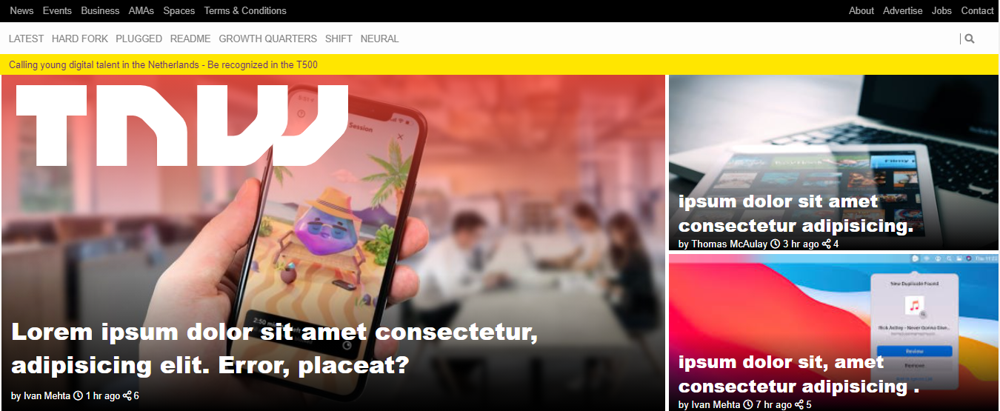

# TNW Website

Second Project

This is a project to demonstrate the existing knowledge of HTML and CSS. It is a individual project that shows the TNW Website

The webpage is focused of showing positioning of elements using grid, flexbox and positioning.

<i>Built With HTML5, CSS3, GIT, and VSCODE</i>

Live Demo : [The-livedemo-link](https://github.com/Leon-Mbegera/TNW2)

<h1>Getting Started</h1>

To get a local copy up and running follow these simple example steps.

1. Go to https://github.com/Leon-Mbegera/TNW2/
2. Click on code and copy the html code.
3. Use git bash to clone this repository on your local machine.
4. Run git checkout -b your-branch-name Make your contributions
5. Push your branch up to your forked repository
6. Open a Pull Request with a detailed description to the development branch of the original project for a review

Prerequisites Text editor, Github profile and Git.

<h2>Author</h2>

👤 Leon Mbegera Kabati

- Github: [@Leon-Mbegera](https://github.com/Leon-Mbegera)
- Linkedin: [leon mbegera](https://www.linkedin.com/in/leon-mbegera-053991174/)
<h2>
🤝 Contributing 
</h2>
Contributions, issues and feature requests are welcome!

Feel free to check the issues page.

Show your support Give a ⭐️ if you like this project!

📝 License This project is a collaboration project of microverse students. All rights are reserved for Leon Mbegera
